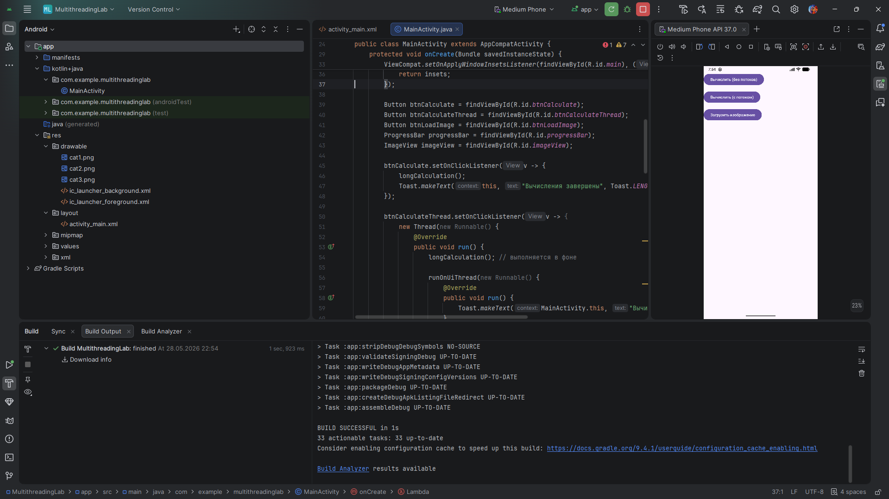
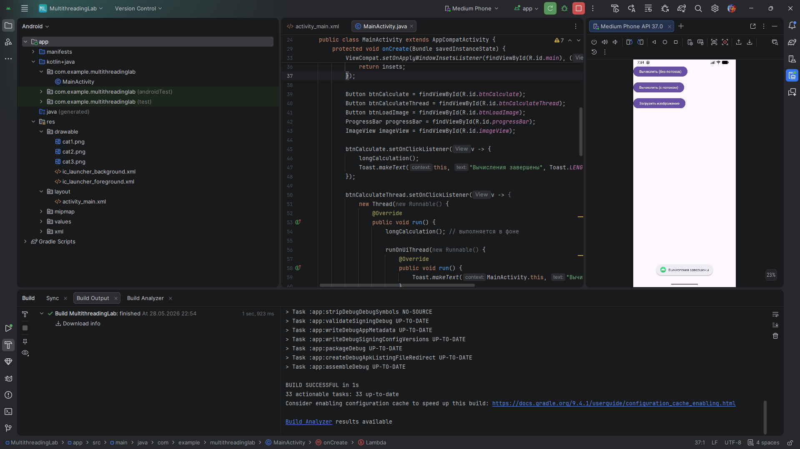
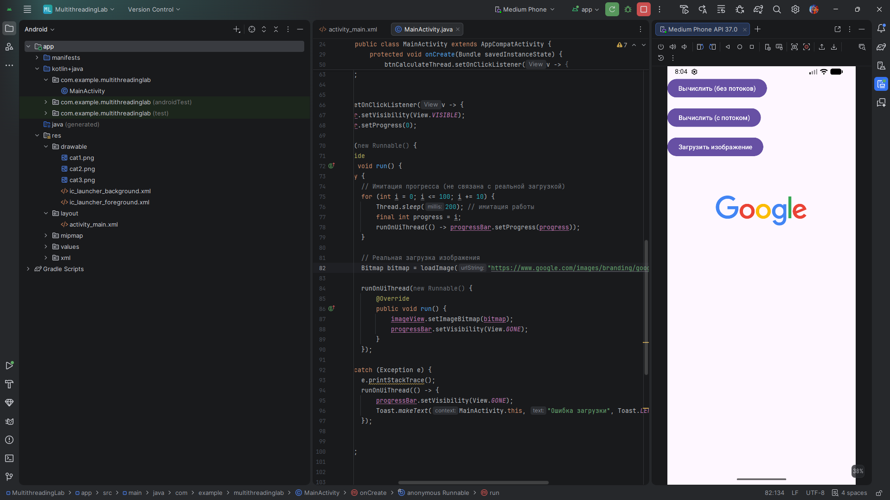

# Практическая работа №11: Многопоточность в Android. Асинхронная загрузка данных

**Выполнил:**  
Шкуро Арсений Александрович
Группа: ИНС-б-о-24-1  
Направление: 09.03.02 «Информационные системы и технологии»

---

## Цель работы

Изучить принципы многопоточного программирования в Android. Научиться выносить длительные операции (вычисления, загрузка данных из сети) в фоновые потоки, чтобы избежать блокировки пользовательского интерфейса. Освоить способы обновления UI из фоновых потоков.

---

## Ход работы

### Задание 1. Создание проекта и подготовка интерфейса

Создан проект `MultithreadingLab`. В `activity_main.xml` размещены три кнопки (демонстрация зависания, вычисления в потоке, загрузка изображения), `ProgressBar` и `ImageView`.



**Рисунок 1** — интерфейс


### Задание 2. Демонстрация «зависания» интерфейса

Реализован метод `longCalculation()` с тяжёлым циклом. При нажатии на кнопку «Вычислить (без потоков)» метод вызывается прямо в UI-потоке – интерфейс блокируется на несколько секунд.



**Рисунок 2** — «зависания» интерфейса

**Фрагмент кода:**
```java
private void longCalculation() {
    long result = 0;
    for (long i = 0; i < 2_000_000_000L; i++) result += i;
    Log.d(TAG, "Результат: " + result);
}

btnCalculate.setOnClickListener(v -> {
    longCalculation();
    Toast.makeText(this, "Вычисления завершены", Toast.LENGTH_SHORT).show();
});
```

### Задание 4: Загрузка изображения из интернета с отображением прогресса



**Рисунок 3** — Загрузка изображения из интернета с отображением прогресса
Добавлено разрешение INTERNET в манифест. Реализована загрузка изображения по URL в фоновом потоке с имитацией прогресса (обновление ProgressBar). После загрузки картинка устанавливается в ImageView.
Фрагмент кода:
```java
private Bitmap loadImage(String urlString) throws IOException {
    URL url = new URL(urlString);
    HttpURLConnection conn = (HttpURLConnection) url.openConnection();
    conn.setDoInput(true);
    conn.connect();
    return BitmapFactory.decodeStream(conn.getInputStream());
}

btnLoadImage.setOnClickListener(v -> {
    progressBar.setVisibility(View.VISIBLE);
    new Thread(() -> {
        try {
            for (int i = 0; i <= 100; i += 10) {
                Thread.sleep(200);
                final int progress = i;
                runOnUiThread(() -> progressBar.setProgress(progress));
            }
            Bitmap bitmap = loadImage("https://www.google.com/images/branding/googlelogo/1x/googlelogo_color_272x92dp.png");
            runOnUiThread(() -> {
                imageView.setImageBitmap(bitmap);
                progressBar.setVisibility(View.GONE);
            });
        } catch (Exception e) {
            runOnUiThread(() -> {
                progressBar.setVisibility(View.GONE);
                Toast.makeText(MainActivity.this, "Ошибка загрузки", Toast.LENGTH_SHORT).show();
            });
        }
    }).start();
});
```
## Индивидуальное задание

Тема: фоновые вычисления и загрузка изображений.
Вариант: В одномерном массиве вещественных чисел вычислить:
а) Номер минимального по модулю элемента массива.
б) Сумму модулей элементов массива, расположенных после первого отрицательного элемента.
Дополнительно: загрузить несколько изображений из сети с отображением общего прогресса.

Работа выполнена в отдельной активности IndividualActivity.

Часть 1. Вычисления в фоновом потоке
Генерация массива случайных вещественных чисел заданного размера, расчёт требуемых характеристик и обновление индикатора прогресса выполняются в отдельном потоке. Для возврата результатов используется runOnUiThread().

Часть 2. Загрузка изображений с прогрессом
Изображения (5 штук) загружаются последовательно из заранее заданных URL. Каждое успешно загруженное изображение сразу добавляется в LinearLayout как новый ImageView. Общий прогресс (ProgressBar) показывает долю загруженных изображений.
```java
new Thread(() -> {
    String[] urls = {"https://picsum.photos/id/1/200/200", ...};
    for (int i = 0; i < urls.length; i++) {
        Bitmap bitmap = loadImage(urls[i]); // HttpURLConnection, BitmapFactory
        runOnUiThread(() -> {
            ImageView iv = new ImageView(context);
            iv.setImageBitmap(bitmap);
            imagesContainer.addView(iv);
        });
        int progress = (i + 1) * 100 / urls.length;
        runOnUiThread(() -> progressImages.setProgress(progress));
        Thread.sleep(300);
    }
    runOnUiThread(() -> progressImages.setVisibility(View.GONE));
}).start();
```


**Рисунок 5** — Индивидуальное задание
## Контрольные вопросы
### 1. Что такое главный (UI) поток? Почему нельзя выполнять длительные операции в нём?

Главный поток (UI-поток) — это основной поток приложения, в котором происходит отрисовка интерфейса, обработка событий от пользователя и взаимодействие с компонентами. Если в UI-потоке выполняется длительная операция (например, загрузка файла, сложные вычисления), поток занят и не может обрабатывать новые события, что приводит к «зависанию» интерфейса. Если блокировка длится более 5 секунд, система показывает диалог «Приложение не отвечает» (ANR).

### 2. Что такое ANR (Application Not Responding)? При каких условиях возникает?

ANR — это диалог, появляющийся, когда приложение не отвечает на действия пользователя в течение определённого времени. Возникает, если:

UI-поток заблокирован более чем на 5 секунд (например, долгие вычисления или синхронный сетевой запрос в главном потоке).

Не обрабатывается событие BroadcastReceiver.onReceive() в течение 10 секунд (для фоновых приемников) или 5 секунд (для приемников, запущенных на переднем плане).

### 3. Как создать новый поток в Java? Как запустить выполнение кода в этом потоке?

Новый поток создаётся через класс Thread, передавая ему объект Runnable. Для запуска вызывается метод start(). Пример:

```java
Thread thread = new Thread(new Runnable() {
    @Override
    public void run() {
        // код, выполняемый в фоновом потоке
    }
});
thread.start();
```
Метод run() содержит код, который будет выполнен в новом потоке. Прямой вызов run() выполнит код в текущем потоке, а не создаст новый.

### 4. Почему нельзя обновлять UI из фонового потока напрямую? Как правильно обновить интерфейс из другого потока?

Android требует, чтобы все изменения UI-компонентов (изменение текста, фона, изображений) происходили только в UI-потоке. Если фоновый поток попытается напрямую изменить интерфейс, будет выброшено исключение CalledFromWrongThreadException.
Для обновления UI из фонового потока необходимо передать действие в главный поток одним из способов:

runOnUiThread(Runnable action) — выполняет код в UI-потоке из любого другого потока.

Handler с привязкой к главному Looper (new Handler(Looper.getMainLooper())) и метод post().

View.post(Runnable) — публикует Runnable в очередь сообщений View.

### 5. Для чего используется класс Handler? Как с его помощью отправить сообщение в UI-поток?

Handler позволяет отправлять сообщения и объекты Runnable в очередь сообщений потока, к которому он привязан. Для связи с UI-потоком создаётся Handler с главным Looper:

```java
Handler mainHandler = new Handler(Looper.getMainLooper());
mainHandler.post(new Runnable() {
    @Override
    public void run() {
        // обновление UI
    }
});
```
Также Handler может отправлять объекты Message с помощью sendMessage() или postDelayed() для отложенного выполнения.

### 6. Что такое ExecutorService? В чём его преимущество перед созданием потоков вручную?

ExecutorService — это фреймворк для управления пулом потоков. Он абстрагирует создание, повторное использование и завершение потоков. Преимущества по сравнению с ручным созданием Thread:

Повторное использование потоков (экономия ресурсов).

Управление количеством одновременно работающих потоков.

Возможность получения результата выполнения задачи через Future.

Удобное завершение всех задач (метод shutdown()).

Лучшая обработка исключений.

Пример создания однопоточного исполнителя:

```java
ExecutorService executor = Executors.newSingleThreadExecutor();
executor.execute(runnableTask);
```
### 7. Почему AsyncTask считается устаревшим? Какие альтернативы рекомендуется использовать?

AsyncTask объявлен устаревшим (deprecated) начиная с Android 11 (API 30) по нескольким причинам:

Сложность обработки жизненного цикла активности (утечки памяти при поворотах экрана).

Неоднозначное поведение при параллельном выполнении (в разных версиях API по-разному).

Неудобство обработки ошибок.

Наличие более современных и гибких инструментов.

Рекомендуемые альтернативы:

java.util.concurrent (ExecutorService, ThreadPoolExecutor).

Kotlin Coroutines (для проектов на Kotlin).

WorkManager для отложенных фоновых задач.

Handler и Loader для специфических сценариев.

### 8. Как отобразить прогресс выполнения длительной операции с помощью ProgressBar?

Для отображения прогресса необходимо:

В XML-разметке разместить ProgressBar (горизонтальный, если прогресс определённый).

Перед запуском фоновой задачи сделать progressBar.setVisibility(View.VISIBLE) и установить начальное значение progressBar.setProgress(0).

В процессе выполнения задачи периодически вызывать runOnUiThread(() -> progressBar.setProgress(value)) для обновления полосы прогресса.

После завершения скрыть индикатор: progressBar.setVisibility(View.GONE).

Если точный процент неизвестен, можно использовать неопределённый (indeterminate) ProgressBar, просто показав и скрыв его.
